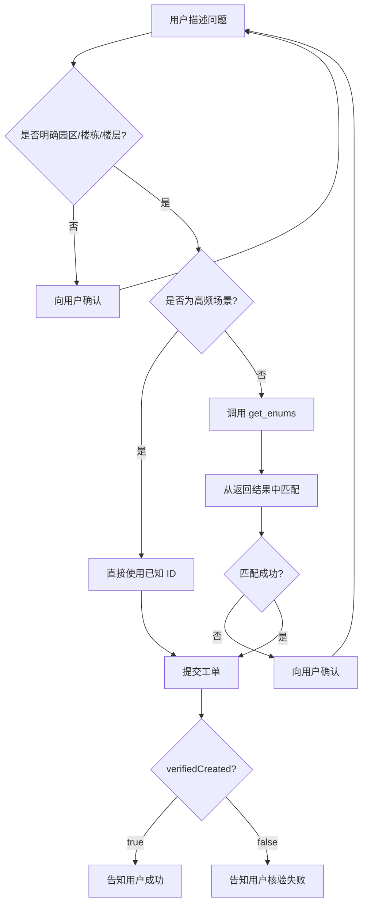

# 快手报修系统 - 最终设计方案

## 设计原则

### ❌ 错误方案（已废弃）
将所有园区、楼栋、楼层的 ID 硬编码到文档中：
- ❌ 维护成本极高（全国几十个园区、上百栋楼）
- ❌ 数据容易过期（新增楼栋/楼层需要手动更新）
- ❌ 文档体积膨胀（几百行的枚举表）

### ✅ 正确方案（最终采用）
**动态查询 + 智能匹配**：
1. 只在文档中记录**高频场景**的示例（如元中心 T2-4层）
2. 遇到非高频场景时，**强制调用 `get_enums` 动态查询**
3. AI 从查询结果中智能匹配 parkId、buildId、floorId

---

## 核心流程

### 提交报修的完整流程



---

## 关键规则

### 1. 园区识别（第一优先级）

| 用户表述 | 识别为 | parkId | 处理方式 |
|---------|--------|--------|---------|
| 元中心、T1、T2 | 北京·元中心 | 58 | 继续识别楼栋 |
| 万家灯火、C | 北京·万家灯火 | 56 | 继续识别楼栋 |
| 上海、星联 | 上海·星联科技园 | 29 | 调用 get_enums |
| 其他关键词 | 未知园区 | - | 向用户确认 |

### 2. 楼栋识别（第二优先级）

**仅针对已识别园区**：
- 元中心 + T1 → buildId 75
- 元中心 + T2 → buildId 76
- 万家灯火 + C → buildId 73
- 其他组合 → 调用 get_enums

### 3. 楼层识别（第三优先级）

**禁止硬编码！必须动态查询！**

唯一例外：高频场景可直接使用：
- 元中心 T2-4层 → floorId 334
- 万家灯火 C-5FC → floorId 309

其他所有场景必须：
```bash
uv run scripts/repair_api.py --action get_enums
```
然后从结果中搜索匹配。

---

## 实际案例

### 案例 1：高频场景（无需查询）

**用户输入**：
```
位置：元中心 T2-4层 工位023
问题：空调太热
```

**AI 处理**：
1. 识别：元中心 → parkId 58
2. 识别：T2 → buildId 76
3. 识别：4层 → floorId 334（高频场景，直接使用）
4. 匹配问题类型：空调 → typeId 101
5. 提交工单

---

### 案例 2：非高频场景（需要查询）

**用户输入**：
```
位置：元中心 T1-2层 智能卫生间
问题：显示不准
```

**AI 处理**：
1. 识别：元中心 → parkId 58
2. 识别：T1 → buildId 75
3. **T1-2层 非高频，调用 get_enums**
4. 从返回结果中搜索：
   ```
   园区 [58] 北京·元中心
     楼栋 [75] 1号楼
       楼层 [327] 2层  ← 匹配！
   ```
5. 确定：floorId 327
6. 匹配问题类型：智能化系统 → typeId 需确认
7. 提交工单

---

### 案例 3：陌生园区（完全依赖查询）

**用户输入**：
```
位置：广州·广电平云广场 A塔 9F
问题：空调不制冷
```

**AI 处理**：
1. 识别：广州 → 需查询
2. **调用 get_enums**
3. 从返回结果中搜索：
   ```
   园区 [50] 广州·广电平云广场
     楼栋 [62] A塔
       楼层 [202] 9F  ← 匹配！
   ```
4. 确定：parkId 50, buildId 62, floorId 202
5. 匹配问题类型：空调 → typeId 101
6. 提交工单

---

## 查询工单的规范

### 位置信息展示原则

**强制使用接口返回的 `location` 原值**：
- ✅ 正确：`北京·万家灯火大厦/万家灯火大厦/5FC区`
- ❌ 错误：`万家灯火 C5`（擅自简化）
- ❌ 错误：`元中心 T2-5层`（擅自推断）

**禁止根据记忆或历史推断园区**！

---

## 文档结构

### SKILL.md
- 只列举 2-3 个高频场景示例
- 强制要求 AI 调用 get_enums
- 详细说明匹配流程

### references/enums.md
- 只列举园区列表和结构示例
- 不列举完整的楼层映射表
- 指引 AI 调用接口获取

### TEST_SCENARIOS.md
- 测试高频场景
- 测试非高频场景
- 测试陌生园区

---

## 优势

✅ **可扩展**：新增园区/楼栋无需修改文档  
✅ **数据准确**：每次都从接口获取最新数据  
✅ **维护简单**：文档保持精简，只需维护核心逻辑  
✅ **性能优化**：高频场景快速响应，非高频场景动态查询  

---

## 注意事项

1. **get_enums 的调用时机**：
   - 首次处理报修请求时
   - 遇到非高频场景时
   - 上下文中没有枚举数据时

2. **避免重复查询**：
   - 如果当前会话已有 get_enums 结果，优先复用
   - 只有当用户提到的园区不在已有结果中时，才重新查询

3. **匹配失败时**：
   - 必须向用户确认，不得猜测
   - 可以列出候选项让用户选择
